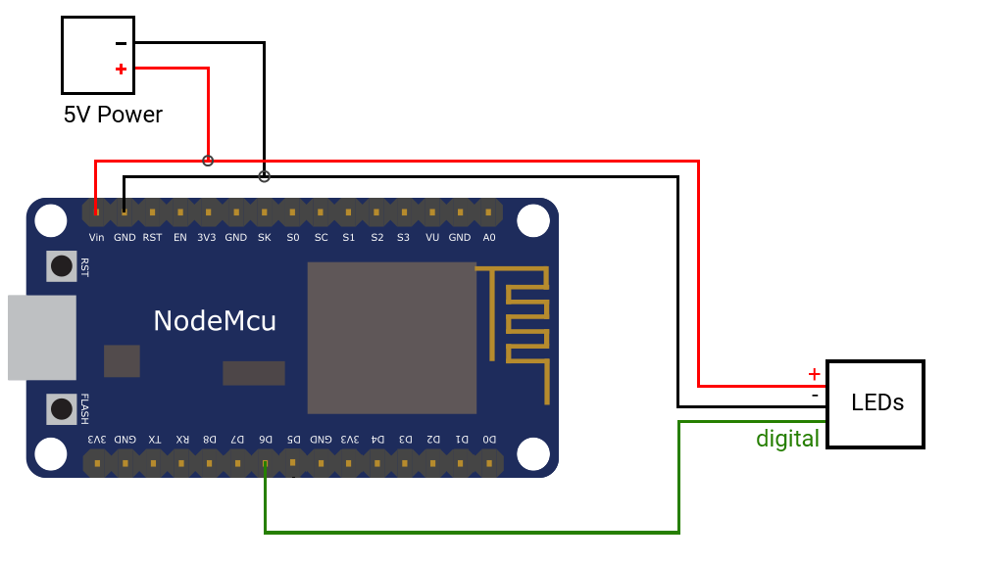

# Matlab Lichtorgel
A simple Lightshow, programmed in matlab. This project allows you to calculate a lightshow in matlab from a local .mp3 file. As an output device you can use a Arduino or NodeMCU (i would prefer the NodeMCU, to get a fast Serial communucation).

# Wireing

In this code i use the NodeMCU:
**Vin** for 5V power
**GND** for Ground
**D6** for LED communication

